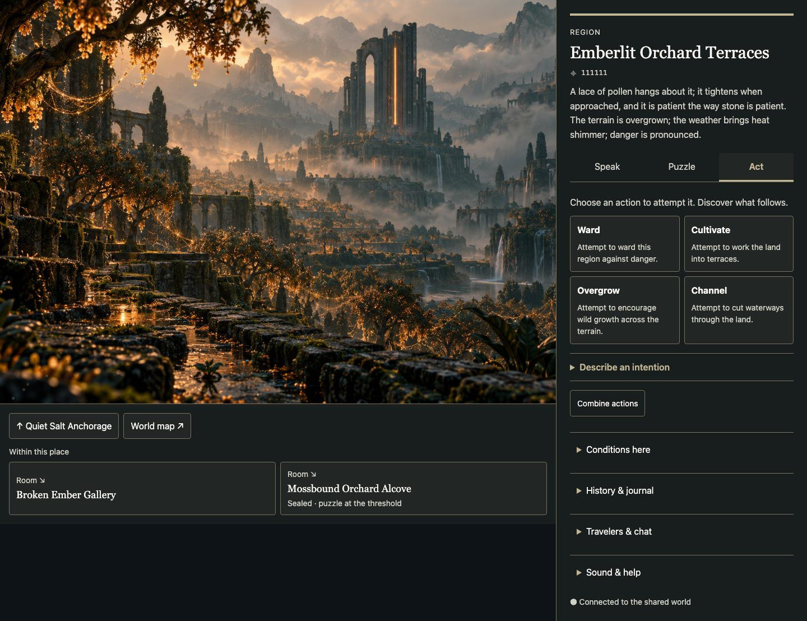
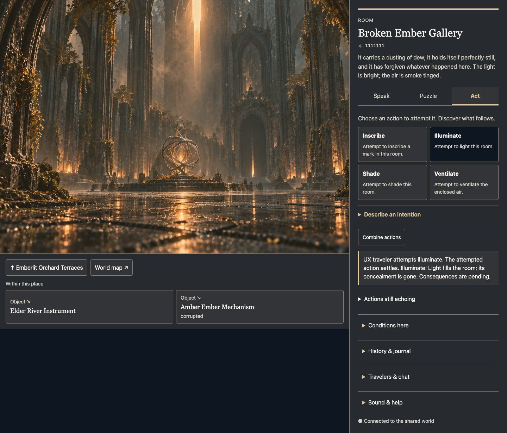

# UX, navigation and evolving visual language

September 21, 2026. Review candidate based on refreshed main `e038d19`, after
[Commit, then discover #106](https://github.com/mark-weeks/hello-nested-worlds-adventure/pull/106)
was reviewed and merged. All 15 review threads were resolved. This batch changes
presentation and navigation; accepted action semantics, consent and recovery
contracts remain intact. No merge, deployment or next batch is included.

## Assessment and agreed arrangement

The baseline scene and map were inspected at desktop and 390px widths on a copy
of the existing playtest world before proposing changes. Navigation was split
between scene controls and panel links; the map repeated its scene link. Utility
links and an always-visible feed competed with participation. Small terminal-style
copy and fixed-height mobile panels made essential controls harder to read and
created nested scrolling. There was no simple return trail. Map Puzzle required
a second Find Puzzle action after choosing the tab.

The owner confirmed: **use the starting arrangement** — movement beside the scene,
one identity block, Speak | Puzzle | Act immediately below that block, secondary
history/details disclosed. The implementation keeps those purposes in one surface
per client. Four suggestions remain visible in Act, followed by a prominent
Describe an intention disclosure and optional combination. No additional composer,
settings system, preview or mandatory confirmation was added.

Wide layouts put the scene/map and movement beside the reading panel. Narrow
layouts form one scrolling document, retaining the same order. The enclosing-place
button names the destination; within-place cards include scale and sealed state.
Wrap travel shares that surface. Return to a visited place holds the last eight
places in this client tab and does not write world history. Saved position and
Journal remain durable; the temporary trail does not survive reload/client changes.

## Mappings demonstrated before generalization

A temporary HTML study compared these five before/after samples before applying
the shared foundations to both clients. Data came from real born nodes and isolated
v3 settlements. `scripts/visual_language_samples.py` reproduces the ten states in
`frontend/e2e/fixtures/visual-language.json` using a disposable database. This is
design evidence, not an in-game forecast. The final screenshots below instead
come from actual browser commitments through the HTTP service.

| Scale / place | Observed change | Visual reading and judgment |
|---|---|---|
| Region / Emberlit Orchard Terraces | Channel: overgrown terrain / heat shimmer → waterways / ground fog | Green/warm contributions become blue/mist. An early study incorrectly retained pollen atmosphere; current weather now takes precedence. |
| Room / Broken Ember Gallery | Illuminate: flickering → bright | Reading surfaces and retained gallery artwork lighten; positions and control forms stay familiar. Shade supplies the contrasting dark state. |
| Object / Elder River Instrument | Fracture: damaged → corrupted, fractured | Woven-light gold remains; an explicit fracture and dashed rule carry the change, with no red moral warning. Its inaccurate curated plate is withdrawn by the existing selector. |
| Object / Amber Ember Mechanism | Engrave: wax sealed → engraved | Stone/mineral contours differ from the instrument at the same scale. Fine grain carries the inscription without changing control placement. Grain was reduced after visual review so prose remained dominant. |
| Molecule / Distant River Chain | Branch: helical → branched chain | A green contribution and changed geometry description replace the former material expression. The abstract fallback is truthful but less specific than the original chain artwork. |

Color is mixed from observed substance; no identity hash, permanent scale-color
class, moral polarity or pending destination controls it. Fracture, weaving and
engraving also have shape/texture and textual cues. Control order, typography and
hit targets stay consistent. Description length can reflow content; this is not
a promise of fixed pixel coordinates for every state.

### Actual before/after pairs

Each link opens a full-size browser capture at 1440px. The two Object rows are
intentional evidence of within-scale differentiation.

| Place | Before | After |
|---|---|---|
| Region | [Before Channel](media/ux-visual-language/comparison-0-before.jpg) | [After Channel](media/ux-visual-language/comparison-0-after.jpg) |
| Room | [Before Illuminate](media/ux-visual-language/comparison-1-before.jpg) | [After Illuminate](media/ux-visual-language/comparison-1-after.jpg) |
| Woven-light Object | [Before Fracture](media/ux-visual-language/comparison-2-before.jpg) | [After Fracture](media/ux-visual-language/comparison-2-after.jpg) |
| Stone Object | [Before Engrave](media/ux-visual-language/comparison-3-before.jpg) | [After Engrave](media/ux-visual-language/comparison-3-after.jpg) |
| Molecule | [Before Branch](media/ux-visual-language/comparison-4-before.jpg) | [After Branch](media/ux-visual-language/comparison-4-after.jpg) |

## Direct usability review and corrections

The in-app browser was used on the preserved-copy scene and map. The hermetic
Chromium cases capture actual rendered UI at **1440 × 960** and **390 × 844**, with
**200% text** (32px root size), keyboard interaction and reduced motion. Screenshots
were inspected directly; overflow assertions alone initially missed awkward word
breaks at 200%. Rem-based card minimums now give those labels one column. The map
now preserves player pan/zoom after resize when the marker stays visible, and
repositions an off-screen marker without changing zoom. Both corrections came from visual review, not a green-check aesthetic claim.

A real click failure appeared during testing: presence/score updates rebuilt the
passage element between pointer-down and click. Its contents now have a change
signature; unrelated state/callback updates preserve the button and focus. Travel
through a passage moves focus to the new heading. Act preserves intention text
selection/focus during its existing rerenders and preserves receipt recovery.
Chronicle uses native modal focus in the scene and trapped/restored focus in the map.

Puzzle opens directly on its tab. Failed reads provide Retry question in that
same surface. The map discards obsolete question responses after navigation.
Failed initial Act reads provide Listen again; accepted-but-lost commit responses
leave ordinary choices disabled until Recover earlier attempt reconciles the
same receipt. Exactly one accepted attempt remains. Pending prose never names an
unobserved future destination.

| Review condition | Evidence |
|---|---|
| Wide scene and map | [Scene](media/ux-visual-language/scene-wide.jpg), [map](media/ux-visual-language/map-wide.jpg) |
| Narrow scene and map | [Scene](media/ux-visual-language/scene-narrow.jpg), [map](media/ux-visual-language/map-narrow.jpg) |
| 200% text and visible keyboard focus | [Scene](media/ux-visual-language/scene-text-zoom.jpg), [map](media/ux-visual-language/map-text-zoom.jpg) |
| Bright / dark / missing artwork | [Bright gallery](media/ux-visual-language/comparison-1-after.jpg), [shaded gallery](media/ux-visual-language/scene-dark-room.jpg), [failed artwork](media/ux-visual-language/scene-missing-art.jpg) |
| Unavailable choices and safe lost-reply recovery | [Scene](media/ux-visual-language/scene-recovery.jpg), [map](media/ux-visual-language/map-recovery.jpg) |
| Explicit pending consequences | [Scene](media/ux-visual-language/scene-pending.jpg), [map](media/ux-visual-language/map-pending.jpg) |

Resolved-color measurements across the ten comparison states and all three
reading backgrounds: minimum primary text **11.89:1**, supporting/link/attention
text **7.92:1**, boundary **3.12:1**, focus/accent **7.37:1**. Tests also stress 20
extreme/invalid input palettes. These measure token colors on opaque surfaces,
not a whole-site accessibility certification. Reduced motion produces a static
scene with the same controls and state information. The 200% test increases text
size; it does not substitute for physical-device and browser-zoom testing.

## Verification

**Final review-fix gate:** one complete `ENFOLDED_E2E=1 ./scripts/check.sh` invocation
passed Ruff, **1,358 Python (246.96 s)**, **131 Vitest**, byte-fresh production build,
installed-wheel smoke and **89 Playwright (2.3 min)**. The original 39 table
fingerprints were rechecked and remain unchanged. Screenshots below were refreshed
from this run; the reviewed-head Wayback capture is explicitly labeled.

The following records the initial implementation gate before PR review:

All required `ENFOLDED_E2E=1 ./scripts/check.sh` stages passed:

- Ruff clean; **1,358 Python tests** in **246.53 s**.
- **131 Vitest tests**, byte-fresh production build and clean installed-wheel smoke,
  including packaging/serving the new shared JS and CSS assets.
- **75 Playwright tests** in **2.3 min**, including existing action/clarification,
  co-viewer, delayed settlement/restart, history, puzzle, Ideas and wrap behavior.
- After the final keyboard-combination focus polish: all **131 Vitest** passed
  again, the build remained byte-fresh, installed-wheel verification passed again,
  and all **five affected UX cases** passed in **18.4 s**. Their images are the
  committed evidence. Python behavior was unchanged, so its full suite was not repeated.
- Re-generated comparison JSON matches byte for byte; **37 local Markdown targets**
  resolve and `git diff --check` is clean. Scene Chronicle Escape/focus restoration
  was also checked directly in the in-app browser.

The first full run had one obsolete bundle-marker assertion for the old navigation
label (1,357 other Python tests passed). The next run passed all Python tests but
found two test doubles treating an HTTP pace reply as an untyped network error.
Those fixtures now distinguish the real status-bearing reply from transport failure;
the unchanged remaining frontend/build/wheel/browser stages were resumed and passed.
These are completed stage results, not a claim that either interrupted invocation
returned zero before its corrections.

The original playtest database was opened read-only for backup and verification;
all preview writes used `/private/tmp/enfolded-ux-review/worlds.db`. Its **39 table
fingerprints** still match the pre-work baseline, including **4,208 born nodes**
and **1,697 history rows**. Browser fixtures create and discard their own databases.
No original world reset or fixture installation occurred.

## PR #107 review follow-up

The 17 findings on reviewed head `5a36650` were read together with the four replies
inside existing Copilot threads. Thirteen browser scenarios reproduced failures on
that head, including the tall-column and observed-history focus cases previously
reasoned from code. The follow-up adds those regressions plus a resolver-work bound.
The last two rows are not from that head: they were raised against the fix commit
`65b9429` and are addressed here.
The PR's owner-changed ready-for-review state is retained; no merge is authorized.

| Finding | Disposition and evidence |
|---|---|
| React puzzle HTTP ordering | Check HTTP/authored error before `found`. A 429 pace message remains visible with Retry question; successful retry opens the real puzzle. |
| Wayback invisible buttons | Use Text on Raised, Line border, 44px height and rem labels. Computed label contrast is checked against the rendered background; both were 1:1 before. |
| Map puzzle HTTP error loss | Preserve authored HTTP refusal separately from transport failure; same 429/retry scenario passes. |
| Observation meter geometry | Restore 4px track and block fill; browser measures positive fill width/height and retains numeric strength. |
| Map puzzle tab resets | Reuse the current question/draft/hint across tabs; initialize attempts and solved state from the server. Browser checks remaining attempts, one read across a tab round-trip, and disabled solved controls after reload. |
| Missing passage badges | Restore shared danger/corruption/disturbance/stabilization/pressure labels. The render signature includes their values; a changed danger label updates in place. |
| Indistinguishable travelers | Players use diamonds/solid rings; inhabitants use stars/dashed rings, with semantic colors and names. Rows are keyboard buttons. Selected-node refresh no longer fills an inserted presence ring. |
| Tall sticky columns | Remove sticky positioning in both clients. At 1440 × 600 and 200% text, lower passages are reached while the artificially lengthened reading column continues below; no inner scroll well is added. |
| Repeated palette resolution | Resolve once per hierarchy datum and reuse for fill/stroke/affordance ring. The 4,208-node browser fixture makes 4,210 calls including two selected-place calls; current selected refresh still uses fresh conditions. Both counts were understated until the observability correction below; they are now exact. |
| Focus lost on observed-history travel | Hand focus to the stable destination heading before replacing the composer and restore it after navigation. Both clients pass Enter-driven observed-consequence travel. Loading/error fallback remains focusable and renders choices after retry. |
| Vacuous WebSocket readiness | Wayback and delivery fixtures wait for an open socket, not absent text in an initially empty roster. |
| Raw map transport errors | World and puzzle-answer failures use authored local copy; status-bearing HTTP errors retain server copy. Browser aborts each request and checks the visible result. |
| Resize resets pan/zoom | Leave an in-view transform unchanged. Only recenter a lost selection, retaining the player's zoom factor. |
| Dead TextPanel passage props | Remove the four unused props and duplicate wrap calculation; SceneView remains the passage owner. |
| Identical style conditionals | Remove dead constellation/pressure color branches; completion text/star and pressure magnitude remain meaningful non-color cues. |
| Third server launcher | UX and history fixtures share `e2e/server.js` and `scripts/e2e_server.py`: newline port framing, bounded startup/error cleanup, caller-owned or disposable DB, explicit preseed/invite/pump options. |
| Hidden selected map label | Show **You are here** at the marker. This restores orientation while honoring the single identity block instead of repeating its name/address. |
| Resolver instrumentation undercount (raised on `65b9429`) | `apply` resolved through the module-local binding while the export was assembled separately, so a probe on the exported reference could not see it and the selected place resolved three times for a true total of **4,211**, not the asserted **4,210**. `selectNode` now resolves once and hands those tokens to both the page application and the marker; `apply` resolves through the exported reference when a caller supplies none. The selected place resolves twice — its own call and the scene renderer — so **4,210** calls for **4,208** nodes is now exact and fully observable, asserted as equality rather than a bound. A separate case pins that `apply` without tokens is counted and `apply` with tokens does not resolve again; it fails on the unfixed source, reporting **0** observed resolutions. |
| Navigation retry focus loss (raised on `65b9429`) | A same-node `error` → `loading` change removed the focused retry button, and with nothing carrying `data-target="retry"` the keyed lookup no-opped and focus fell to `<body>`; the destination-heading handoff ran only when the node changed. The keyed lookup now falls back to that same heading, matching the Act composer fallback. A browser case focuses Retry passages, drives the status change, then asserts the heading holds focus and the body does not; it fails on the unfixed source. |

The historical-state and failure scenarios use the real UI with controlled HTTP
responses where noted in `ux-review.spec.js`. Passage badge and presence payloads
are explicit browser fixtures, not claimed live-agent observations. The tall-column
case deliberately extends the sidebar to 5,000px to expose the sticky failure;
its screenshots show the scrolled viewport, not a naturally occurring long history.
The instrumented resolver consumed **32.5 ms** in the full local browser run.
That is a local diagnostic, not a performance SLA, total map-render time or a
comparison with the review's separate Node benchmark.

Direct inspection confirmed that the repaired Wayback buttons are recognizable,
the selected map label connects the diagram to the identity panel, and the small
passage-condition line is legible without competing with destination names. Narrow
390px and 200% text captures were inspected separately. The shared test-server
refactor retained history's delayed pump and restart behavior. During the follow-up,
the new loading-focus fallback exposed a retry render suppression; both clients now
allow loaded choices to replace that focused loading surface.

| Representative review evidence | Capture |
|---|---|
| Wayback: unreadable → readable controls | [Reviewed head](media/ux-visual-language/review-wayback-before.jpg), [fixed](media/ux-visual-language/review-wayback-after.jpg) |
| Distinct presence, selected marker and observation meter | [Map](media/ux-visual-language/review-presence.jpg) |
| Tall passages, 200% text, scrolled viewport | [Scene](media/ux-visual-language/review-scene-tall-passages.jpg), [map](media/ux-visual-language/review-map-tall-passages.jpg) |

## Limitations and next handoff

- **Art continuity:** the existing curated-plate selector withdraws misleading
  artwork when a changed terrain/material/silhouette no longer matches. The fallback
  is readable and usable but remains abstract across several scales. Richer scene
  forms and a production art/audio pipeline warrant separate work.
- **Learnability is unproven:** these are design judgments and local browser checks,
  not a player study. Test whether players understand the return trail, discover
  intention entry and learn the color/trace associations over repeated visits.
- **Coverage:** local Chromium and the in-app browser were inspected. No physical
  mobile, Safari, screen-reader, live-model quality or production validation is
  claimed. Standalone Journal, Guide and Ideas pages retain earlier styling.
- **Scope:** no scoring, new action semantics, expanded agent capabilities or
  persistent itinerary was added. Historical v1/v2 receipts and v3 commitments use
  the same existing backend paths.

Next: re-review the fixes on PR #107, using the five comparison pairs and
narrow/zoom/recovery captures, then a scoped playtest. Any further implementation
requires a separate owner instruction after the appropriate reviewed merge.

**Irreversibility check:** none — no migration, golden re-pin, generator/birth
change, new chronicle writer, world-meta/hinge pin or era-bank edit. The runtime
backend diff only serves shared presentation assets; frontend changes extend the
existing movement, interaction and history surfaces. Simulation/receipt code is
unchanged. The sample generator and browser fixtures operate on disposable worlds.
Player autonomy and append-only shared history are preserved.
