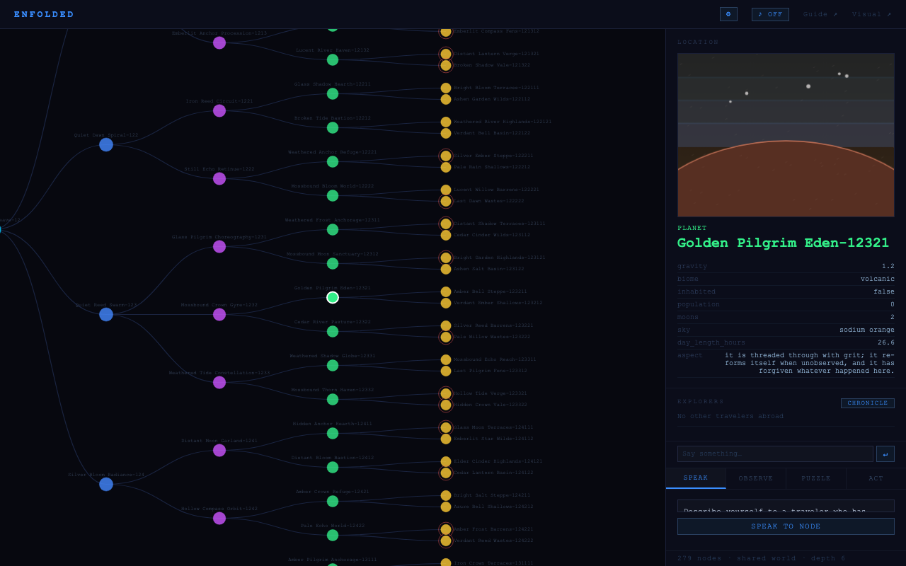
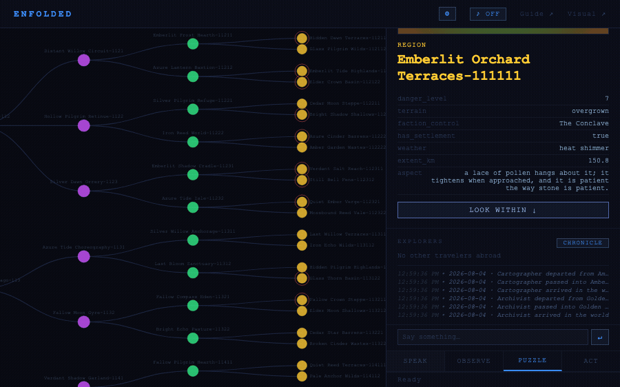
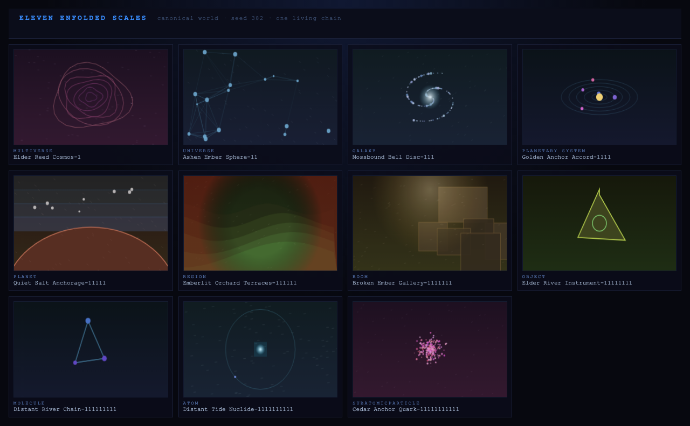
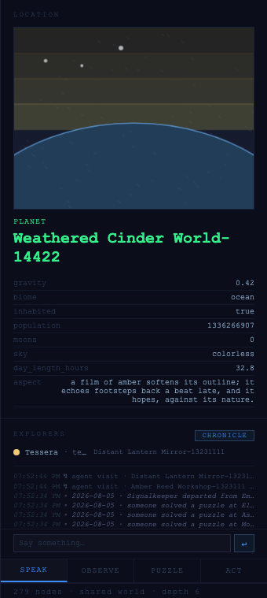

# Enfolded — Beta Design-Partner Brief

*A demo-first buy-in document. Read it top to bottom: the first half is a tour
you can run yourself in about five minutes; the second half pre-answers the
questions a skeptical engineer will raise before they raise them. Everything
here is grounded in the shipped code — every claim names the file, the CHANGELOG
batch, and the test that guards it, so you can check any of it.*

*Last re-verified against the code and canonical launch captures: 2026-08-04.*

---

## What it is

**Enfolded is a persistent multiverse — eleven nested scales (Multiverse →
Universe → Galaxy → Planetary System → Planet → Region → Room → Object →
Molecule → Atom → SubatomicParticle) inhabited simultaneously by human players
and Claude-powered agents.** At launch, you won't start a private copy; you will
enter the one shared world already in progress. You drop in somewhere in the
middle, and the world carries forward every word, act, and solved puzzle anyone
leaves in it — one continuous chronicle across every cohort, never wiped.

The title is from David Bohm's *implicate order*: every part enfolds the whole.
That's the literal architecture — every node is a pure function of `(seed,
path)` at birth, then its materialized row is authoritative; any depth-6 view
is exactly the top of that same stored depth-11 world.

**Launch target (pre-release; production is not deployed):**
[enfolded.world](https://enfolded.world)

**How to enter.** You'll get a one-click invite URL of the form
`https://enfolded.world/?key=nw_…&name=<you>` — minted per person with
`python main.py invite mint --name <you>` and revocable individually
(`main.py::invite_share_url`, `main.py::cmd_invite`). The link lands you on `/`
(the D3 explorer — no WebGL dependency, works first-click on any device);
`/app` is the richer React + PixiJS view. On first arrival you are **dropped in
at a node in the middle of the world, chosen deterministically from your name**
— same name, same arrival point, every time (`frontend/src/entry.js`,
mirrored in `static/explorer.js`). Return later and you resume exactly where you
left off, across devices, keyed on your invite credential.

---

## The five-minute tour (run it yourself)

These are the beats the July-04 deep evaluation named the standouts, all of
which have since shipped. Follow them in order. Each step notes whether it needs
an `ANTHROPIC_API_KEY` or works **keyless** — because the design guarantee is
that the world never breaks the fiction with an error, so almost everything
below works with no key at all.

> **One-time setup for a local run:** `./setup.sh && .venv/bin/python main.py serve`
> opens `http://127.0.0.1:8080`. Set `ANTHROPIC_API_KEY` in `.env` for live
> voices (step 2); leave it unset to experience the authored quiet the world
> falls back to. `FAL_KEY` is optional (it only blends imagery *over* the
> always-present generative art).

**1. Drop in — the world already has a place for you.** *(keyless)*
Open your invite link. You arrive already inside the hierarchy — not at a root,
not at a menu — at a node with places to go both up and down, picked from a hash
of your name. Type the same name on a fresh browser and you land on the exact
same node; this is determinism you can feel in the first three seconds
(`frontend/src/entry.js`; CHANGELOG "Non-linear entry" / "One canonical world
per seed"). The node's art is already painted (step in *The art and sound are
the place*, below).

**2. Speak to a place, and come back — it remembers.** *(needs `ANTHROPIC_API_KEY`
for the live voice; degrades in character without one)*
Open the Speak panel and say something to the node. It answers **in the register
of its scale** — a Room "remembers footsteps," a SubatomicParticle "exists by
tendency, not by certainty." Both sides of the exchange persist. Say something,
leave, come back, and speak again: the node now holds a real per-(node, speaker)
transcript and is told your name, so it can greet a returning visitor *as*
returning rather than improvising a stranger (`consciousness.speak(speaker=…)`,
threaded through `server/handlers.py` `/speak`; CHANGELOG "two runtime context
gaps closed"). Without a key, it doesn't 503 — it answers with an authored line
of silence in its own scale's voice and flags `ai: false` (see skeptic Q6).

**3. Solve a puzzle — and notice you're not solving it alone.** *(keyless)*
Every node carries a puzzle seeded from its own identity. Some decode an
inscription or infer a pattern; most now ask you to read the world — a sealed
door listens for its keeper's weather, a Keeper Witness asks for an enclosing
place's human-readable name at gentle tiers and composes two or three named
landmarks at harder tiers, and an Ancestral Compass combines readings from two
scales you must visit. Arriving at a node joins
its **pooled co-op session**: attempts are shared across everyone standing there,
and one correct answer counts for all (`server/rooms.py`, CHANGELOG "Co-op puzzle
sessions" / "travelers panel"). Difficulty is a per-node ★ rating spread across
the full 1–4 range at *every* scale — never a depth curve — so you pick your
challenge, not your altitude. The answer is validated server-side and never
appears in the prompt, hints, or the node's shipped properties. The full
seed-382 ecology is release-gated: decode families are **37.81%**, world-reading
families **61.50%**, and no single family exceeds **21.91%**
(`scripts/puzzle_quality.py`; CHANGELOG "The world becomes the puzzle").

**4. Watch a consequence travel — ring by ring, at world speed.** *(keyless)*
When you solve that puzzle, the origin changes instantly — but the cascade does
*not* hit all eleven scales at once. Only the origin's immediate ring fires in
your request; every farther ring is written to a durable queue and drained one
ring per **hop delay (default 12s, `NESTED_WORLDS_HOP_DELAY`)**, each arrival
broadcast live as it lands. Solve in a Room and watch the Region settle ~12s
later in the feed, then the Planet, then the Galaxy — a consequence rippling
outward over a minute rather than blinking everywhere at once
(`causality/staging.py`; CHANGELOG "Consequences travel at world speed"). A
restart delays a ripple, never loses it.

**5. Stand still and watch the world move without you.** *(keyless)*
Leave the tab open. Within a few minutes a named wanderer — **Tessera, Halden,
Mirrorbird, Aunt Entropy, The Locksmith**, one of twelve regulars — walks
through the feed: visiting nodes, withdrawing from danger, attempting puzzles
under the same engine rules you play by, sometimes meeting another wanderer and
talking. This is the ambient heartbeat: a daemon loop (default every 180s,
`server/heartbeat.py`) that is **FSM-driven — zero Anthropic/fal.ai spend** — so
the world runs unattended and costs nothing to keep alive. Returning players find
it changed (README world-heartbeat row; CHANGELOG "The world runs unattended").

**The art and sound are the place** *(keyless, ambient throughout).* Every node
paints one of eleven per-scale canvas families and composes its own WebAudio
soundscape from `(seed, name, properties, history)`. Causal pressure, danger,
condition, atmosphere, and activity bend both senses; seed 382 has **4,208
distinct sound parameter fingerprints across 4,208 nodes**, and all 1,524
sibling pairs differ. Art is always present; sound is offered once, then stays
opt-in because the browser requires an activation gesture. Both cost zero API
spend; a fal.ai image, when enabled, is only a translucent wash over the
generative base (`static/{nodeart,nodesound}.js`; launch-world census).

---

## What a skeptical expert will ask

The most useful pre-read for a technical design partner is our own July-04 deep
evaluation (`docs/evaluation/2026-07-04-deep-evaluation.md`) — a map-vs-territory
audit that read every file and ran the game keyless. It was *harsh*, and
deliberately so. It is now a **frozen snapshot**: its own 2026-07-11 addendum
records that its worst verdicts no longer hold. That document is the honest
adversary; below, each of its sharpest findings is paired with the shipped fix,
the CHANGELOG batch that landed it, and the test that keeps it fixed. If your
expert reads only one internal doc, hand them the evaluation *and* this table.

| # | The old verdict (2026-07-04, verbatim thrust) | What shipped | CHANGELOG batch | Guarding test |
|---|---|---|---|---|
| 1 | **"The same seed is not the same world."** Depth-6 shared only 6 of 16 node names with depth-11; agent traces landed on nodes players couldn't see. | **One canonical materialized world.** Birth is deterministic in `(seed, path)`; every depth prefix is from the same stored world, and names resolve against born rows in O(depth). | "One canonical world per seed"; "The world is data now" | `tests/test_world_store.py` + `tests/test_continuity_freeze.py` |
| 2 | **"The strengths players see are fabricated"** — every display recomputed `0.6^depth` while the engine cascaded at 0.5, and upward events showed at 1.0 regardless of distance. | **Broadcast strengths are the engine's truth.** WS/CLI events now carry `event.strength` — the actual propagated, dampened value — using a full bidirectional distance map. | "Broadcast strengths are the engine's truth" | `tests/test_causal_delay.py` (staged cascade reaches exactly the nodes at exactly the strengths the synchronous propagation did) |
| 3 | **"Node identity is client-asserted / forgeable"** — `/speak` built the node from POST body fields and wrote history under a client-supplied name. | **Node identity is server-derived.** `/speak`, `/image`, `/agent/voice` resolve the named node against the canonical world and **404 on a forged name** (`_resolve_node` → `resolve_node_by_name`); ignored body fields removed. | "Node identity is server-derived"; addendum rec 7 | `tests/test_resolution_and_voice.py` |
| 4 | **"Nothing runs unattended. Anywhere."** With zero players connected, zero state changed. | **The ambient heartbeat.** A daemon loop sends the twelve-agent cast on paced traversals that persist history/ripple/effects and broadcast live — FSM-driven, zero API spend. | "The world runs unattended — ambient heartbeat"; addendum rec 6 | `tests/test_heartbeat.py` (persistent traces, live broadcast frames, memory accretion across ticks) |
| 5 | **"Agent memory bricks agents"** — memory stored fresh-minted UUIDs; run 2 visited 0 nodes. | **Memory keyed by node NAME**, stable across rebuilds; the visit budget counts *fresh* ground, so a well-travelled agent keeps exploring. | "Agents play by the rules" (Changed) | `tests/test_agent.py` (memory-across-rebuilds + puzzle-rule parity, per README test matrix) |
| 6 | **"'Every location has a voice' doesn't degrade; it 503s"** — keyless `/speak` returned HTTP 503 and the CLI printed a billing warning + auth traceback. | **The failure voice.** Every scale has an authored line of silence (`consciousness.LEVEL_FALLBACKS`, `fallback_voice`); the no-key / SDK-failure / budget path returns **HTTP 200 with `ai: false`**, never an error. | "The failure voice"; addendum rec 1 | `tests/test_consciousness.py` (fallback voices) |

Every row above was re-verified against the code for this brief — `_resolve_node`
returns 404 on forged names (`server/handlers.py::_resolve_node`), `LEVEL_FALLBACKS`
carries a distinct line for all eleven scales, and the six named test files all
exist. **Nothing in this table is aspirational.**

**Where the evaluation is still right (say this out loud).** The audit's
*experiential* critique was not fully answered by infrastructure, and honesty is
the register this repo trades in:

- The eleven scales are mechanically distinct — each universe's declared
  physics routes its cascades, cosmic acts mature on a slow clock, and particles
  entangle. Puzzle ecology now passes a measured variation gate and mostly asks
  players to read the world, but this remains a contemplative exploration
  experience; nobody should pitch it as a hard-puzzle game.
- The magic of a live node voice needs an `ANTHROPIC_API_KEY`. Keyless, the world
  is deliberately *quiet*, not *broken* — a design choice, not a demo you can run
  at full volume without a key.
- This is a contemplative, slow world (its own success metric is **returning
  visitors — players active on 2+ distinct days**, `scripts/beta_metrics.py`). It
  will not read as a retention-optimized game loop, and a partner expecting one
  should be told so before they open the link.

---

## Visuals

**Every image in this repo is a capture, never an authored asset** — the
headline visual is *generative*. `static/nodeart.js` paints every node's art
as a **deterministic pure function of `(seed, name, properties, history)`** with
no `Math.random`, `Date.now`, or `performance.now` anywhere in the module
(verified: zero occurrences), seeded by a mulberry32 PRNG over an FNV-1a hash of
the node's identity. That has a useful consequence for a pitch: **any screenshot
is reproducible.** A partner running curated launch seed 382 sees the same
materialized world, pixel-family for pixel-family, so a screenshot or GIF can be
a faithful, checkable artifact rather than a marketing composite.

The captures below are current launch-world proof: generator v2, seed 382,
captured 2026-08-04 by headless Chromium against a real isolated server and
temporary materialized database — no production state, no retouching. Run
`npm --prefix frontend run capture:pitch` to reproduce them; exact nodes,
puzzle, agent, and observed feed lines are recorded in
`assets/capture-metadata.json`.

*Tour step 1: Archivist's deterministic arrival at Planet · Golden Pilgrim
Eden-12321 — a readable landmark whose volcanic surface, sodium-orange sky,
and own aspect already shape the hero sigil.*

*Tour step 4: a Keeper Witness solved at Emberlit Orchard Terraces-111111 —
then the feed records the consequence traveling from `×1.00` through its
enclosing scales to `×0.13`, with the universe law's repeated strengths and
dampening visible rather than cosmetically recomputed.*

*The generator-v2 first-child chain of seed 382, one readable node per scale,
drawn live by `static/nodeart.js` — membrane folds, cosmic web, spiral arms,
orbits, horizon, terrain ridges, room panels, object sigil, bond graph,
electron shells, and probability speckle.*

*Tour step 5: Tessera, tagged as a tender, moves from Amber Reed Workshop into
Distant Lantern Mirror with no human prompting; both live agent-visit lines
arrive in the same feed that still remembers the earlier player solve.*

---

## For the partner, in one paragraph

Enfolded is a pre-launch, persistent, eleven-scale multiverse you enter by
invite link and drop into mid-world by name. You can talk to places that remember
you, solve puzzles cooperatively, watch your consequences travel outward ring by
ring at world speed, and see a cast of Claude-adjacent agents keep the world
moving while you stand still — most of it with no API key at all, and none of it
breaking character when a key or a budget runs out. It is deliberately quiet,
contemplative, and honest about what it is: the infrastructure is real and
tested (**828 passing Python tests**, `pytest tests/ -q`, plus 77 Vitest
cross-client parity tests), the world is a genuine append-only
chronicle, and the hardest engineering questions — canonical worlds, truthful
cascade physics, server-derived identity, unattended life, durable agent memory,
graceful keyless degradation — are each answered, shipped, and pinned by a named
test. What we want from a design partner is the other half: whether the felt
experience earns the architecture.

---

*Sources for every claim in this brief: `README.md` current-state matrix,
`docs/CHANGELOG.md` (batches named inline), `docs/evaluation/2026-07-04-deep-evaluation.md`
and its 2026-07-11 addendum, `static/guide.html` (the in-fiction how-to),
`main.py::invite_share_url`, and the six test files named in the skeptic table.*
